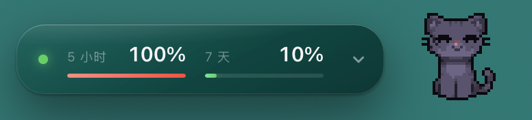
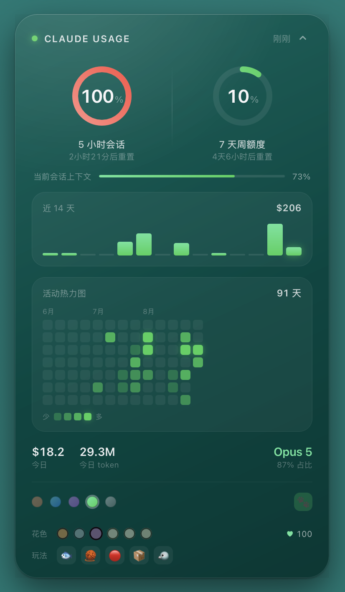

<div align="center">

# Claude Usage

**A frosted-glass card on your desktop that tells you how much Claude and Codex quota is left.**

**Plus a pixel cat that lives there.**


[](https://www.apple.com/macos/)
[](#install)
[](LICENSE)
[](#codex-too)

[简体中文](README.md) · **English**

</div>

---

## 🐾 The cat

It really lives on your desktop — not inside a window. Switch apps, drag things around, it's still there.

<div align="center">
<table>
<tr>
<td align="center" width="190">
<br>
<b>Loafing</b><br>
<sub>Tail sways, blinks now and then</sub>
</td>
<td align="center" width="190">
<br>
<b>Asleep</b><br>
<sub>Curls up if ignored for a while</sub>
</td>
<td align="center" width="190">
<br>
<b>Six coats</b><br>
<sub>Pick one, switch any time</sub>
</td>
</tr>
</table>
<sub>Ginger · Grey · Black · Cream · Calico · Siamese</sub>
</div>

**Poke it.** It squints, hops, pops a heart, then goes back to whatever it was doing.

Pet it enough and it remembers you — that `♥` in the panel is the running count. At **100** you get to name it.

### Things to do with it

<div align="center"></div>

| | | |
|---|---|---|
| 🐟 | **Fish** | Drop one and it trots over to eat it |
| 🧶 | **Yarn** | Pounces, bats it around |
| 🔴 | **Laser** | A red dot skitters across your desktop for ~13s. It never catches it |
| 📦 | **Box** | Climbs in, sits with just its head out, hums to itself ♪ |
| 🐦 | **Bird** | Drops into a slow stalk. Get too close and the bird leaves |

---

## 🐟 Feed the human

The cat runs on pixel fish. I don't.

If it made your desktop a little more fun, you can [buy us something](https://ifdian.net/a/sonetto_zhou):

<div align="center">
<table>
<tr>
<td align="center" width="190"><b>🐟 Dried fish</b><br><sub>Cat remembers you</sub></td>
<td align="center" width="190"><b>🥤 Soda</b><br><sub>Cat gets cuter</sub></td>
<td align="center" width="190"><b>☕ Coffee</b><br><sub>I keep coding</sub></td>
</tr>
</table>
</div>

**Supporters get:**

- 📛 **Your name here** — whatever name or link you want, in the [wall of fame](#-wall-of-fame)
- 💡 **Skip the queue** — want the cat to learn a new trick? Another stat on the card? Supporters' requests go first

**Not supporting is completely fine.** A ⭐ makes my day too.

<div align="center">

[](https://ifdian.net/a/sonetto_zhou)

</div>

---

## 🏆 Wall of fame

Nobody yet. First spot is yours 🐾

<!-- SPONSORS -->

---

## 📊 The widget

**Works with Claude and Codex.** Whichever you have installed shows up; if you have both, tabs in the header switch between them.

<table>
<tr>
<td width="58%" valign="top" align="center">

<br>
<sub><b>Most of the time</b> — one pill, two numbers, cat sunbathing next to it</sub>
<br><br>
<div align="left">
Expand it and you get:
<ul>
<li><b>5-hour</b> and <b>weekly</b> quota rings — they turn amber, then red, as they fill</li>
<li>Context used in the current session</li>
<li>Spend over the last 14 days</li>
<li>91-day activity heatmap</li>
<li>Tokens today, and which model ate them</li>
</ul>
Bottom row has the accent colours, a 中/EN switch, and the cat toggle. Five colour themes.
</div>
</td>
<td width="42%" valign="top" align="center">

<br>
<sub><b>Click the chevron</b> — everything's in here</sub>
</td>
</tr>
</table>

---

## Install

Three routes. Pick one — they all land in the same place.

| Your situation | Route |
| :-- | :-- |
| Already using Claude Code | **A**, one sentence |
| You have Homebrew | **B** |
| Neither, or GitHub is slow where you are | **C**, two lines, nothing to install first |

### A · Let Claude Code do it

Hand it this:

```
install https://github.com/yuemuqing-thu/claude-usage-widget for me
```

It reads the README and figures the rest out.

### B · With Homebrew

```sh
brew install yuemuqing-thu/tap/claude-usage-widget
claude-usage-widget install
```

<details>
<summary>Don't have Homebrew yet?</summary>

It's the package manager most macOS developers use. Open Terminal, paste this, hit return ([from brew.sh](https://brew.sh)):

```sh
/bin/bash -c "$(curl -fsSL https://raw.githubusercontent.com/Homebrew/install/HEAD/install.sh)"
```

It'll print one or two more commands to add `brew` to your PATH — **follow those**, then come back and run the two lines above.

Or skip it entirely: **route C doesn't need Homebrew at all.**

</details>

### C · Without Homebrew

Paste these two lines into Terminal:

```sh
curl -fL https://github.com/yuemuqing-thu/claude-usage-widget/archive/refs/heads/main.tar.gz | tar -xz
cd claude-usage-widget-main && sh install.sh
```

**If GitHub is unreachable or crawling** (mainland China, mostly) — change only the first line by adding a mirror prefix, leave the second alone:

```sh
curl -fL https://ghfast.top/https://github.com/yuemuqing-thu/claude-usage-widget/archive/refs/heads/main.tar.gz | tar -xz
```

Still stuck? Swap `https://ghfast.top/` for `https://gh-proxy.com/`.

<details>
<summary>What are those mirror URLs</summary>

Third-party GitHub relays. I don't control them. Everything you download is plain text — `install.sh` plus the shell, awk and jsx under `claude-usage.widget/` — so you can read it before running it.

</details>

---

### After it's installed

The widget lives at the **top-right of your desktop**.

**Open the panel with the arrow, flip the paw switch — and the cat shows up.**

Seeing "no quota yet" is normal: the two rings are fed by a running Claude Code session. Start a `claude` session, say anything, and they light up a few seconds later.

> [Übersicht](https://tracesof.net/uebersicht/), the host the widget runs in, is installed by the script. It isn't on GitHub — the download comes from `tracesof.net` and is about 70MB. That's the only large part of the install; everything else adds up to under 100KB. If it won't download, grab it from the site, drag it to Applications, and run the script again.

### Codex too

**Nothing to do** — if Codex is installed it shows up automatically. The panel header turns into **Claude / Codex** tabs; click to switch.

> **Here's exactly what it does.** Codex has no statusLine hook the way Claude Code does — its status bar only takes built-in items, not custom scripts — and quota numbers never touch disk. The only way to get those two rings is to read the login credentials **already sitting in** `~/.codex/auth.json` and ask ChatGPT's own backend.
>
> - Credentials go **to chatgpt.com and nowhere else** — no third party is involved
> - The bar chart and heatmap are computed from local session files, **no network**
> - It's an undocumented endpoint, so OpenAI can change it at any time. If that happens it quietly falls back to "no data" and Claude keeps working
> - **No `~/.codex` on your machine means none of this runs** — no credential read, no requests
>
> Don't want it: `claude-usage-widget codex off` (wipes the cache and snapshot too).

### Something's wrong

```sh
claude-usage-widget doctor
```

Prints what it found and where it broke. **Everything is redacted** — tokens are reported as a character count, never a value — so the output is safe to paste into an issue.

Installed via route C? Run `sh install.sh doctor` from the folder you extracted.

### Uninstall

Installed via **A / B**:

```sh
claude-usage-widget uninstall          # widget, config, cache
brew uninstall claude-usage-widget     # the command itself
brew uninstall --cask ubersicht        # the host, if you only got it for this
```

Installed via **C**, from the folder you extracted:

```sh
sh install.sh uninstall
```

---

## What you need

- macOS 12 or newer
- [Claude Code](https://claude.com/claude-code) — the two rings are fed by its statusLine
- Nothing else. The widget runs on `sh` / `awk` / `osascript` that ship with macOS. **No Node, no Python, no jq.**

---

## How it gets the numbers

Two independent sources, and it's worth knowing which is which:

**The two rings** come from Claude Code's statusLine. Every time it refreshes, a small script writes the official percentages to a snapshot file. That means **the rings only update while a Claude Code session is running** — if the card dims, that's stale data, not a bug. Start a session and it lights up.

**Everything else** — the bar chart, the heatmap, the token counts — is computed locally from `~/.claude/projects/**/*.jsonl`, the transcripts Claude Code already writes. Those files are append-only, so the collector tracks a byte offset per file and only reads what's new. First run takes a couple of seconds; after that it's a few milliseconds.

**Nothing is uploaded.** Without Codex installed, the widget makes no network requests at all. With it, the only outbound call is to `chatgpt.com` for your own quota numbers.

> The dollar figures are *equivalent* cost — what the same tokens would run on pay-as-you-go API pricing. On a subscription you don't pay them. It's there to compare days against each other, not to predict a bill.

---

<div align="center">

**More detail** — how the cat was made, how the quota system actually works,
customisation, file layout, troubleshooting — is in the
**[Chinese README](README.md)**.

</div>

---

## About the art

The cat sprites **started as AI-generated images** (reference art from Midjourney and Jimeng, then traced into real sprites by script).

Code is MIT. The pixel art makes no copyright claim — take it.

## Thanks

- [Übersicht](https://tracesof.net/uebersicht/) — the desktop widget host
- Usage data is read from `~/.claude/` and `~/.codex/` on your own machine. **Nothing is uploaded.**
- One outbound call, only if Codex is installed: your own credentials to `chatgpt.com` for quota numbers.
