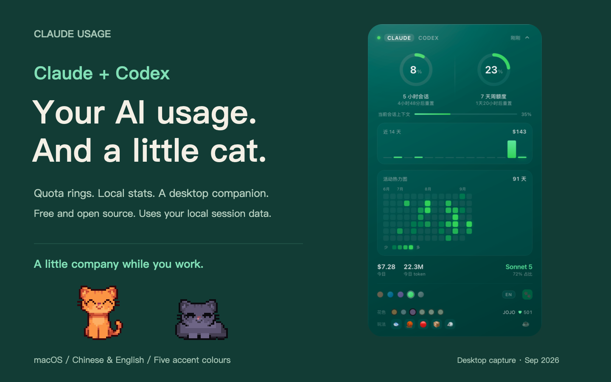
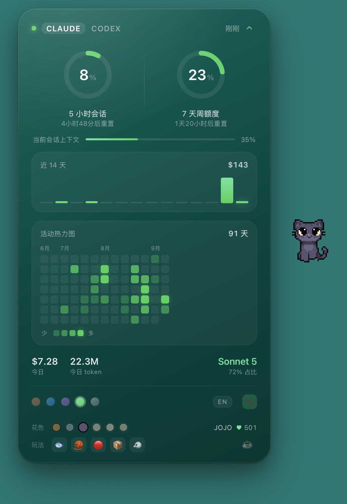

<div align="center">

# Claude Usage

**Claude and Codex usage, right on your Mac desktop.**

**Plus a pixel cat that lives there.**



[](https://www.apple.com/macos/)
[](#install)
[](LICENSE)
[](#codex-too)

[简体中文](README.md) · **English**

[Install](#install) · [Usage](#-the-widget) · [Meet the cat](#-the-cat) · [Buy us a coffee](https://ifdian.net/a/sonetto_zhou)

</div>

---

Already have Homebrew? Two commands to bring the cat home:

```sh
brew install yuemuqing-thu/tap/claude-usage-widget
claude-usage-widget install
```

No Homebrew, or want Claude Code to handle it? [Other installation options](#install).

For **macOS 12+** with **Claude Code or Codex** on your machine. Usage is read and calculated locally; no extra account credentials are needed.

## 🐾 The cat

It lives on your desktop. Move the mouse away and it follows; leave it alone and it swishes its tail, then settles down for a nap.

<div align="center">

</div>

<div align="center">
<table>
<tr>
<td align="center" width="190">
<br>
<b>Loafing</b><br>
<sub>Tail sways, blinks now and then</sub>
</td>
<td align="center" width="190">
<br>
<b>Asleep</b><br>
<sub>Curls up if ignored for a while</sub>
</td>
<td align="center" width="190">
<br>
<b>Six coats</b><br>
<sub>Pick one, switch any time</sub>
</td>
</tr>
</table>
<sub>Ginger · Grey · Black · Cream · Calico · Siamese</sub>
</div>

**Poke it.** It squints, hops, pops a heart, then goes back to whatever it was doing.

Pet it enough and it remembers you — that `♥` in the panel is the running count. At **100** you get to name it.

<details>
<summary><b>Open the toy box: fish, yarn, a laser, a box and a bird</b></summary>

<div align="center"></div>

| | | |
|---|---|---|
| 🐟 | **Fish** | Drop one and it trots over to eat it |
| 🧶 | **Yarn** | Pounces, bats it around |
| 🔴 | **Laser** | A red dot skitters across your desktop for ~13s. It never catches it |
| 📦 | **Box** | Climbs in, sits with just its head out, hums to itself ♪ |
| 🐦 | **Bird** | Drops into a slow stalk. Get too close and the bird leaves |

</details>

---

## 🐟 Feed the human

The cat runs on pixel fish. I don't.

If it made your desktop a little more fun, you can [buy us something](https://ifdian.net/a/sonetto_zhou):

<div align="center">
<table>
<tr>
<td align="center" width="190"><b>🐟 Dried fish</b><br><sub>Cat remembers you</sub></td>
<td align="center" width="190"><b>🥤 Soda</b><br><sub>Cat gets cuter</sub></td>
<td align="center" width="190"><b>☕ Coffee</b><br><sub>I keep coding</sub></td>
</tr>
</table>
</div>

**Supporters get:**

- 📛 **Your name here** — whatever name or link you want, in the [wall of fame](#-wall-of-fame)
- 💡 **Skip the queue** — want the cat to learn a new trick? Another stat on the card? Supporters' requests go first

**Not supporting is completely fine.** A ⭐ makes my day too.

<div align="center">

[](https://ifdian.net/a/sonetto_zhou)

</div>

---

## 🏆 Wall of fame

Nobody yet. First spot is yours 🐾

<!-- SPONSORS -->

---

## 📊 The widget

**Works with Claude and Codex.** Whichever you have installed shows up; if you have both, tabs in the header switch between them.

<p align="center">
<a href="docs/shot-desktop-20260918.png"></a>
</p>

- **Quota and resets:** separate 5-hour and weekly readings, with amber and red warnings as they fill.
- **Local history:** 14-day trends, a 91-day heatmap, today's tokens and model share. Claude also shows current context usage.
- **Make it yours:** drag or collapse the card, choose from five accent colours, and switch between English and Chinese.

Dollar amounts are **API-equivalent estimates, not a bill**. Quota readings update with local sessions; the widget shows their age. The screenshot above uses Chinese, one of the two supported languages. [Promotional image pack](docs/xiaohongshu/README.md)

---

## Install

Three routes. Pick one — they all land in the same place.

| Your situation | Route |
| :-- | :-- |
| Already using Claude Code | **A**, one sentence |
| You have Homebrew | **B** |
| Neither, or GitHub is slow where you are | **C**, two lines, nothing to install first |

### A · Let Claude Code do it

Hand it this:

```
install https://github.com/yuemuqing-thu/claude-usage-widget for me
```

It reads the README and figures the rest out.

### B · With Homebrew

```sh
brew install yuemuqing-thu/tap/claude-usage-widget
claude-usage-widget install
```

<details>
<summary>Don't have Homebrew yet?</summary>

It's the package manager most macOS developers use. Open Terminal, paste this, hit return ([from brew.sh](https://brew.sh)):

```sh
/bin/bash -c "$(curl -fsSL https://raw.githubusercontent.com/Homebrew/install/HEAD/install.sh)"
```

It'll print one or two more commands to add `brew` to your PATH — **follow those**, then come back and run the two lines above.

Or skip it entirely: **route C doesn't need Homebrew at all.**

</details>

### C · Without Homebrew

Paste these two lines into Terminal:

```sh
curl -fL https://github.com/yuemuqing-thu/claude-usage-widget/archive/refs/heads/main.tar.gz | tar -xz
cd claude-usage-widget-main && sh install.sh
```

**If GitHub is unreachable or crawling** (mainland China, mostly) — change only the first line by adding a mirror prefix, leave the second alone:

```sh
curl -fL https://ghfast.top/https://github.com/yuemuqing-thu/claude-usage-widget/archive/refs/heads/main.tar.gz | tar -xz
```

Still stuck? Swap `https://ghfast.top/` for `https://gh-proxy.com/`.

<details>
<summary>What are those mirror URLs</summary>

Third-party GitHub relays. I don't control them. Everything you download is plain text — `install.sh` plus the shell, awk and jsx under `claude-usage.widget/` — so you can read it before running it.

</details>

---

### After it's installed

The widget lives at the **top-right of your desktop**.

**Open the panel with the arrow, flip the paw switch — and the cat shows up.**

Seeing "no quota yet" is normal: the two rings are fed by a running Claude Code session. Start a `claude` session, say anything, and they light up a few seconds later.

> [Übersicht](https://tracesof.net/uebersicht/), the host the widget runs in, is installed by the script. It isn't on GitHub — the download comes from `tracesof.net` and is about 70MB. That's the only large part of the install; everything else adds up to under 100KB. If it won't download, grab it from the site, drag it to Applications, and run the script again.

### Codex too

To compare quota readings, finish a short Codex turn, run `/status` inside Codex, then wait 15–30 seconds for the widget. Pause other Codex tasks during the check. The widget shows **used** quota: if Codex says “80% left,” compare it with 20% used. Check the same quota pool and reset times; context usage is a separate number.

**Nothing to do** — the widget follows what's on the machine: with both installed you get **Claude / Codex** tabs in the header, click to switch; with only one, you just get that one, no empty tab left over.

<details>
<summary>Where the numbers come from · Freshness and compatibility</summary>

> **Where the numbers come from.** At the end of every turn Codex writes a `token_count` event into its session log, carrying the server's `rate_limits` snapshot — `used_percent`, `window_minutes`, `resets_at`. The two rings read that directly.
>
> - Quota and stats are read **entirely from `~/.codex/sessions/` on your machine — no network requests, and your login credentials are never touched**
> - How fresh the rings are = when you last used Codex. The widget shows it ("3 min ago") and marks it when it goes stale
> - Windows are matched by `window_minutes` (300 → 5h, 10080 → 7d), so a different plan won't swap them around
> - If your Codex is too old to write that field, the rings say "no data" and the chart and heatmap carry on
> - Sessions older than 7 days get compressed to `.jsonl.zst`; reading those needs `zstd` (installed automatically via `brew`; without it you only get the last week of history, and `doctor` says so)
> - **No `~/.codex` on your machine means none of this runs**
>
> Don't want it: `claude-usage-widget codex off` (wipes the cache and snapshot too).

</details>

### Something's wrong

```sh
claude-usage-widget doctor
```

Prints what it found and where it broke. **Everything is redacted** — tokens are reported as a character count, never a value — so the output is safe to paste into an issue.

Installed via route C? Run `sh install.sh doctor` from the folder you extracted.

<details>
<summary><b>Uninstall · Remove the widget and optional host</b></summary>

Installed via **A / B**:

```sh
claude-usage-widget uninstall          # widget, config, cache
brew uninstall claude-usage-widget     # the command itself
brew uninstall --cask ubersicht        # the host, if you only got it for this
```

Installed via **C**, from the folder you extracted:

```sh
sh install.sh uninstall
```

</details>

---

## What you need

- macOS 12 or newer
- [Claude Code](https://claude.com/claude-code) **or Codex** on your machine; quota readings come from Claude's statusLine or Codex session logs.
- Nothing else. The widget runs on `sh` / `awk` / `osascript` that ship with macOS. **No Node, no Python, no jq.**

---

## How it gets the numbers

Two independent sources, and it's worth knowing which is which:

**The two rings** come from Claude Code's statusLine. Every time it refreshes, a small script writes the official percentages to a snapshot file. That means **the rings only update while a Claude Code session is running** — if the card dims, that's stale data, not a bug. Start a session and it lights up.

The installer asks Claude Code to refresh that local status line every 5 seconds. Combined with the widget's 15-second polling interval, an active session normally appears fresh within 5–20 seconds, including during long-running turns.

**Everything else** — the bar chart, the heatmap, the token counts — is computed locally from `~/.claude/projects/**/*.jsonl`, the transcripts Claude Code already writes. Those files are append-only, so the collector tracks a byte offset per file and only reads what's new. First run takes a couple of seconds; after that it's a few milliseconds.

**Nothing is uploaded, and nothing is fetched.** The widget makes no network requests at all — with or without Codex.

> Figures prefixed with `≈$` are *API-equivalent estimates* at standard list prices. Subscription users are not charged them. Fast mode and long-context multipliers cannot always be reconstructed from daily local totals; an unrecognized model shows `—` instead of silently using a made-up default price.

---

<div align="center">

**More detail** — how the cat was made, how the quota system actually works,
customisation, file layout, troubleshooting — is in the
**[Chinese README](README.md)**.

</div>

---

## About the art

The cat sprites **started as AI-generated images** (reference art from Midjourney and Jimeng, then traced into real sprites by script).

Code is licensed under MIT. The author claims copyright in the pixel artwork and reserves the associated rights; the artwork is not covered by the code's MIT license. Installing and running this project is unaffected. Please contact the author before separately using, adapting or distributing the artwork. See [asset licensing](ASSETS-LICENSE.md).

## Thanks

- Claude and GPT / Codex — assistance with development, debugging and project documentation
- [Übersicht](https://tracesof.net/uebersicht/) — the desktop widget host
- Usage data is read from `~/.claude/` and `~/.codex/` on your own machine. **Nothing is uploaded.**
- No outbound calls, ever.
