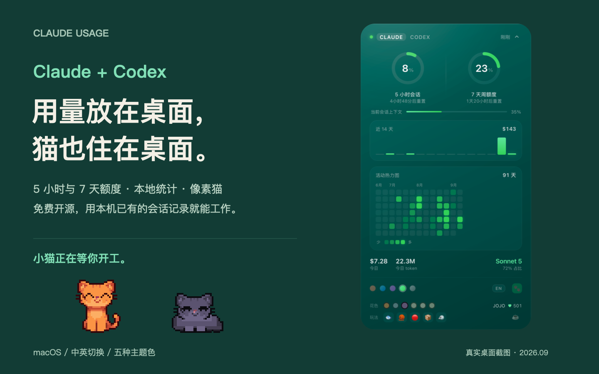
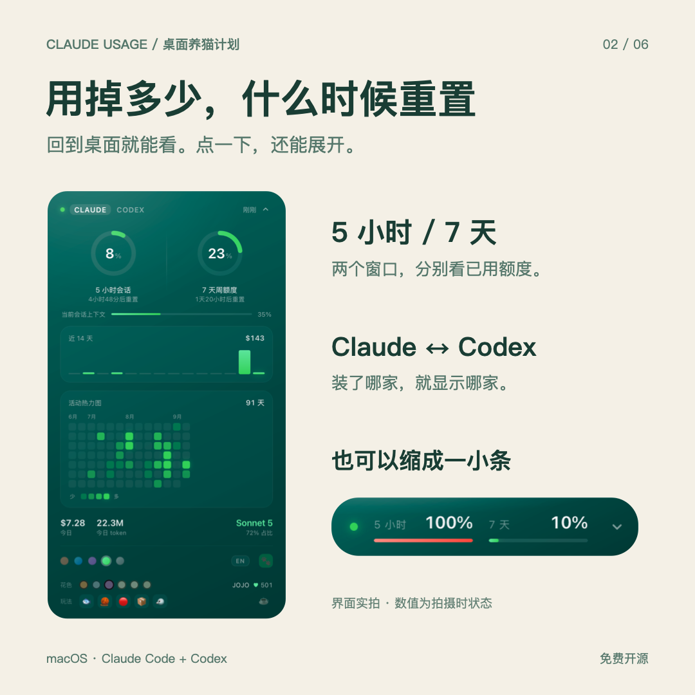
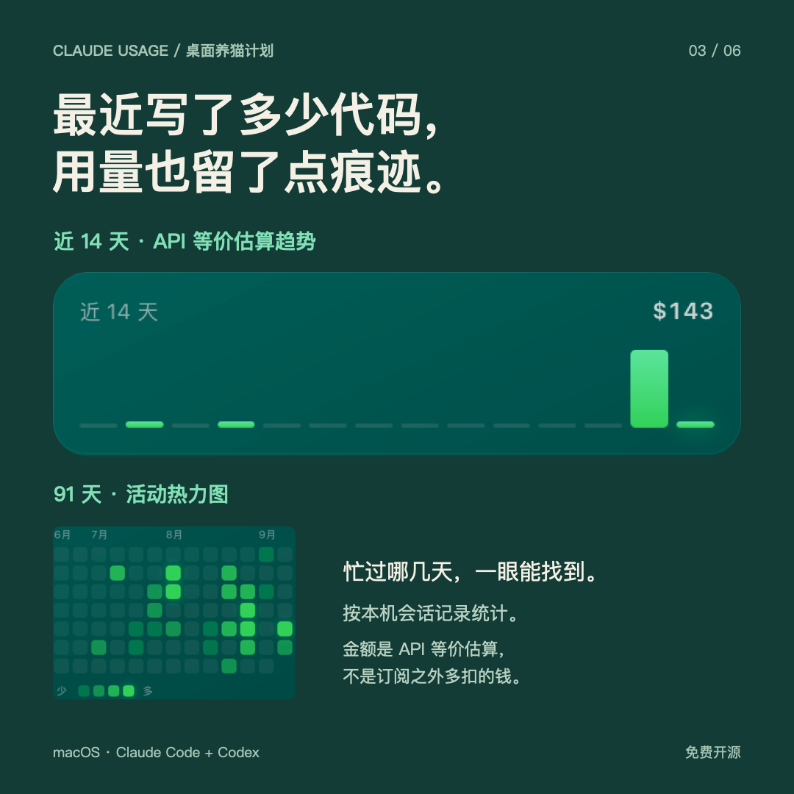

<div align="center">

# Claude Usage

**Claude 和 Codex 的用量，放在 Mac 桌面上看。**

**外加一只住在桌面上的像素猫。**



[](https://www.apple.com/macos/)
[](#安装)
[](LICENSE)
[](#也想看-codex-的用量)

**简体中文** · [English](README.en.md)

[安装](#安装) · [看用量](#-用量挂件) · [陪猫玩](#-小猫) · [请猫喝咖啡](https://ifdian.net/a/sonetto_zhou)

</div>

---

已经有 Homebrew？两行命令，把猫接回桌面：

```sh
brew install yuemuqing-thu/tap/claude-usage-widget
claude-usage-widget install
```

没有 Homebrew，或想让 Claude Code 帮忙安装？[往这里走](#安装)。

适用于 **macOS 12+**，配合本机的 **Claude Code 或 Codex** 使用。用量在本地读取和计算，不需要再提供账号密码。

## 🐾 小猫

它住在桌面上。鼠标挪远一点，它就跟过来；闲下来会晃尾巴，等久了自己趴下睡觉。

<div align="center">

</div>

<div align="center">
<table>
<tr>
<td align="center" width="190">
<br>
<b>发呆</b><br>
<sub>尾巴晃，偶尔眨眼</sub>
</td>
<td align="center" width="190">
<br>
<b>睡着了</b><br>
<sub>没人理就自己趴下</sub>
</td>
<td align="center" width="190">
<br>
<b>换毛</b><br>
<sub>六种花色随时换</sub>
</td>
</tr>
</table>
<sub>橘猫 · 灰猫 · 黑猫 · 奶白 · 三花 · 暹罗</sub>
</div>

**戳它一下。** 它会眯起眼睛蹦一下、头顶冒个爱心，然后继续该干嘛干嘛。

摸得多了它会记住你 —— 展开面板右边那个 `♥` 就是攒下来的次数。

<details>
<summary><b>打开玩具箱：鱼、毛线球、激光点、纸箱和小鸟</b></summary>

<div align="center"></div>

| | | |
|---|---|---|
| 🐟 | **小鱼** | 丢下去，它会颠颠地跑过去吃掉 |
| 🧶 | **毛线球** | 扑上去打两下 |
| 🔴 | **激光笔** | 红点满桌乱窜十几秒，它疯狂追 —— 快追到就换地方，一辈子抓不着 |
| 📦 | **纸箱** | 钻进去坐着，只露个头和耳朵，还哼歌 ♪ |
| 🐦 | **小鸟** | 它会压低身子慢慢摸过去，靠太近鸟就飞了 |

</details>

---

## 🐟 投喂

这只猫吃像素小鱼干就够了。**我不行，我得吃真的。**

如果它让你的桌面变得有意思了那么一点点，可以在 [爱发电](https://ifdian.net/a/sonetto_zhou) 请我们吃点东西：

<div align="center">
<table>
<tr>
<td align="center" width="190"><b>🐟 小鱼干</b><br><sub>猫会记得你</sub></td>
<td align="center" width="190"><b>🥤 快乐水</b><br><sub>猫猫更可爱</sub></td>
<td align="center" width="190"><b>☕ 咖啡</b><br><sub>加班写代码</sub></td>
</tr>
</table>
</div>

**发电之后可以：**

- 📛 **留个名** —— 你想展示的名字、昵称、网站链接，会出现在下面的[猫粮榜](#-猫粮榜)里
- 💡 **插队提需求** —— 想让猫学个新动作？想加个统计维度？发电者的建议我优先做

**不发电也完全没关系。** 觉得好玩的话点个 ⭐ 我就很高兴了。

<div align="center">

[](https://ifdian.net/a/sonetto_zhou)

</div>

---

## 🏆 猫粮榜

还没有人投喂过。第一个位置给你留着 🐾

<!-- SPONSORS -->

## 📊 用量挂件

**Claude / Codex，一张卡片里切换。** 只装了一家就只显示那家；平时可以收成一小条，需要时再展开。

<p align="center">


</p>

- **额度与重置时间**：5 小时 / 7 天分别显示，快满时变橙、变红。
- **本地用量记录**：近 14 天趋势、91 天热力图、今日 token 和模型占比；Claude 还能看当前上下文占用。
- **摆成自己喜欢的样子**：可拖动、可折叠，五种主题色，中英切换。

图中美元金额是 **API 等价估算，不是实际账单**。额度随本地会话更新，卡片会显示更新时间。[查看本次桌面原图](docs/shot-desktop-20260918.png) · [下载六张宣传图](docs/xiaohongshu/README.md)

---

## 安装

三条路，挑一条走完就行 —— 装出来的东西完全一样。

| 你的情况 | 走哪条 |
| :-- | :-- |
| 已经在用 Claude Code | **A**，一句话的事 |
| 有 Homebrew | **B** |
| 两样都没有，或者连不上 GitHub | **C**，两行命令，什么都不用先装 |

### A · 让 Claude Code 替你装

把这句话丢给它：

```
帮我装 https://github.com/yuemuqing-thu/claude-usage-widget
```

它会读 README 自己搞定。

### B · 用 Homebrew

```sh
brew install yuemuqing-thu/tap/claude-usage-widget
claude-usage-widget install
```

<details>
<summary>还没有 Homebrew？</summary>

它是 macOS 上装软件用的工具。打开「终端」，粘贴这行回车（[官网](https://brew.sh)原文）：

```sh
/bin/bash -c "$(curl -fsSL https://raw.githubusercontent.com/Homebrew/install/HEAD/install.sh)"
```

装完它会让你再跑一两行命令把 `brew` 加进 PATH，**照着屏幕上的提示做完**，再回来跑上面两行。

嫌麻烦的话，**路线 C 根本不需要 Homebrew**，两行就完事。

</details>

### C · 不用 Homebrew

把这两行贴进「终端」回车：

```sh
curl -fL https://github.com/yuemuqing-thu/claude-usage-widget/archive/refs/heads/main.tar.gz | tar -xz
cd claude-usage-widget-main && sh install.sh
```

**连不上 GitHub（中国大陆网络）** —— 只改第一行，加个镜像前缀，第二行不变：

```sh
curl -fL https://ghfast.top/https://github.com/yuemuqing-thu/claude-usage-widget/archive/refs/heads/main.tar.gz | tar -xz
```

还是下不动就把 `https://ghfast.top/` 换成 `https://gh-proxy.com/`。

<details>
<summary>这两个镜像地址是什么</summary>

第三方的 GitHub 加速转发，我不控制它们。下载下来的东西全是纯文本（`install.sh`，以及 `claude-usage.widget/` 里的 shell、awk 和 jsx），装之前可以直接打开读一遍。

Homebrew 换成中科大镜像也能走通，但 `brew tap` 那步仍然要连 GitHub，所以不如直接用上面两行。

</details>

---

### 装完之后

挂件在**桌面右上角**。

**点开右侧箭头展开，打开里面的爪印开关 —— 猫就出来了。**

如果只看到「还没拿到订阅额度」，那是正常的：两个环要由一个运行中的 Claude Code 会话喂数据，随便开一个 `claude` 会话说句话，几秒后就会亮。

> 挂件的宿主 [Übersicht](https://tracesof.net/uebersicht/) 是脚本自动装的。它不在 GitHub，安装包在官网 `tracesof.net`，约 70MB —— 整个安装里只有这一步是大的，其余加起来不到 100KB。真下不动就自己从官网下载拖进「应用程序」，再重新运行一次脚本。

### 也想看 Codex 的用量

想核对两个额度环是否准确，可以按[人工对照步骤](docs/VERIFY_CODEX.md)操作。挂件显示的是**已用**比例；Codex 若显示剩余，需要用 100% 减去它再比较。

**不用做任何事** —— 挂件跟着这台机器上装了什么走：两样都有就在标题处给出 **Claude / Codex** 两个页签，点一下就切；只装了其中一个，就只显示那一个，不会留个空页签。

> **数字是怎么来的。** Codex 每个回合结束会往会话记录里写一条 `token_count` 事件，里面带着服务端返回的 `rate_limits` 快照 —— `used_percent`、`window_minutes`、`resets_at` 齐全。两个环直接读它。
>
> - 额度和统计**全部读自本机 `~/.codex/sessions/`，不发任何网络请求，也不碰你的登录凭据**
> - 环里的数字新鲜度 = 你最后一次用 Codex 的时间，挂件会直接显示（「3 分钟前」），太旧会标黄
> - 两个窗口按 `window_minutes` 归位（300 → 5 小时，10080 → 7 天），换套餐也不会错位
> - Codex 版本太旧、还不写这个字段的话，环显示「暂无数据」，柱状图和热力图照常
> - 7 天以上的会话 Codex 会压成 `.jsonl.zst`，读它需要 `zstd`（`brew` 装的话会自动带上；没有就只统计最近一周，`doctor` 会提示）
> - **机器上没有 `~/.codex` 就完全不触发**
>
> 不想要：`claude-usage-widget codex off`（连缓存和快照一起删）

### 出问题了

```sh
claude-usage-widget doctor
```

会打印它找到了什么、哪一步断了。**所有值都脱敏**（token 只报长度，不报内容），输出可以直接截图发给别人看。

走路线 C 装的，命令换成在解压出来的目录里跑 `sh install.sh doctor`。

### 卸载

走 **A / B** 装的：

```sh
claude-usage-widget uninstall          # 撤掉挂件、还原配置、清缓存
brew uninstall claude-usage-widget     # 删掉命令本身
brew uninstall --cask ubersicht        # 顺便把宿主也删了（如果只为这个装的）
```

走 **C** 装的，在解压出来的目录里跑：

```sh
sh install.sh uninstall
```

---

## 需要什么

- macOS 12 以上
- 本机的 [Claude Code](https://claude.com/claude-code) **或 Codex** —— 分别通过 statusLine 和会话记录提供额度数据
- 没了。挂件只用 macOS 自带的 `sh` / `awk` / `osascript`，**不需要 Node、Python、jq**

---

<details>
<summary><b>怎么挪位置 · 临时藏起来 · 彻底关掉</b></summary>

### 移动位置 · 临时隐藏 · 彻底关掉

Übersicht 挂件贴在壁纸层，**没有自带的拖动和关闭按钮**，所以这三件事分别是：

### 换位置：直接拖

**按住药丸拖动**即可。展开状态下按住顶栏（`CLAUDE USAGE` 那一行）拖。

- 落点记在 `localStorage`，重启不丢
- 拖到屏幕边缘会被自动夹回来，永远不会拖丢
- 停在屏幕**下半部分**时，展开的卡片会**向上**长，不会掉出屏幕底部
- **双击左上角的小圆点**恢复默认位置（右上角）

想改默认位置（也就是双击归位后回到哪），编辑 `~/Library/Application Support/Übersicht/widgets/claude-usage.widget/index.jsx` 最顶上：

```js
const POSITION = { top: "48px", right: "48px" };   // 想靠左就把 right 换成 left
```

### 临时隐藏

点**菜单栏的 Übersicht 图标** → 菜单里会列出所有挂件 → 点 `claude-usage` 那一项就能切换显示 / 隐藏（前面的小图标会跟着变）。再点一次就回来。

### 彻底关掉

- 只想让它消失：菜单栏 Übersicht 图标 → **Quit**，所有挂件一起停。
- 想删干净：`claude-usage-widget uninstall`（会移除挂件、还原 `settings.json`、清掉缓存；Übersicht 本身不动）。

### 关于点击

拖动、折叠 / 展开、主题色选择都需要 Übersicht 允许点击挂件。`install.sh` 会自动打开这个开关（Übersicht 偏好设置 → `Interaction: ☑ Enable interaction`）。

这个偏好**只在启动时读取**，所以改完必须真正重启 Übersicht。注意 `osascript ... to quit` 有时会返回成功但应用并没退出，`install.sh` 里是按 PID 确认的。

它按鼠标是否悬停在挂件上动态生效，**不会把桌面空白处的点击吃掉** —— 桌面右键、拖选图标都正常。不想要的话在偏好设置里关掉即可，只是箭头和主题色就点不动了。

---

</details>

## 深入了解

<details>
<summary><b>小猫是怎么做出来的 —— 从一张 AI 生成图反解成精灵图</b></summary>

### 小猫是怎么做出来的

不是手画的，是**从一张参考图反解出来的**：

1. 探测参考图真正的像素网格 —— 枚举格子尺寸和偏移，取「格内色彩方差最小」的那组，测出是 16px / 29×35
2. 逐格取**中位色**（不是单点采样），避开生图工具的噪点和背景渐变；聚类抽出九档色阶，映射成语义字符
3. **补描边** —— 生图工具的轮廓线只有半格宽，采样时会被毛色吃掉，原图放大看边缘是断的。这里从画布外围洪水填充补内部空洞，再把整条剪影外缘重描一遍
4. **重画眼睛** —— 重描边时剪影内部的深色要判成眼睛而不是提亮，否则眼睛会被抹平。按量出来的结构重画：深色杏仁 + 外下侧米白月牙 + 内上角一格白高光，左右镜像
5. 胡须和鼻子在原图里是亚格级细节，采样必然丢，按位置补回去（必须紧贴脸颊描边起笔，否则会变成飘在旁边的黑点）

走路和趴睡都从这张底图衍生：**头（含耳朵和胡须）逐像素复用**，只换身体和四肢 —— 所以几个姿势换来换去还是同一只猫。

走路是**正面摇摆**：整只上下起伏 + 左右晃 1 格 + 两条前腿交替抬起 2 格，底图 100% 复用。三样叠在一起才读得出在走 —— 只靠抬腿的话跟坐着几乎没区别。

### 亲密度

每次互动累积，显示在花色那一排的右边，存在 `localStorage` 的 `cu.love`。

### 实现说明

小猫是一个**独立于 React 的单例**（`window.__cuPet`）：自己建 canvas、自己跑动画循环、自己听鼠标。挂件每 15 秒重渲染一次，如果把它塞进 React 树里每次都会被重建，动画就断了。

**动画时钟和移动时钟是分开的**：移动是连续的（加速度 + 上限速度 + 摩擦，位置每帧按 dt 积分），动画是离散的（每个状态有自己的帧时长，走路时帧率还跟着实际速度变）。早期版本用一个 90ms 的 `setInterval` 同时管这两件事，所以又卡又硬。

精灵图里的帧都是**没有眼睛**的，眼睛由运行时按锚点叠贴片 —— 这样眨眼、眯眼、半睁只要换贴片，不用为每种眼神各存一套帧。

</details>

<details>
<summary><b>数据是从哪来的 —— 两条完全独立的来源</b></summary>

### 数据是从哪来的

两路，各管一半：

### 一、官方额度百分比（两个环）

Claude Code 有个叫 **statusLine** 的扩展点：你配一个命令，它每次刷新状态栏时会把一段 JSON 塞进这个命令的 stdin。这段 JSON 里带着订阅额度的官方数值：

```json
"rate_limits": {
  "five_hour": { "used_percentage": 78.23, "resets_at": 1787640783 },
  "seven_day": { "used_percentage": 31.40, "resets_at": 1787999943 }
}
```

**这是本机唯一能拿到这两个百分比的地方**，跟 `/usage` 里看到的是同一个数。`install.sh` 会把 `bin/claude-usage-statusline.sh` 配成你的 statusLine，它一边在终端里打印状态栏，一边把这些字段快照到 `~/.claude/usage-widget/snapshot.env`，挂件读这个快照。

安装器会让 Claude Code 每 5 秒重跑一次这个本地 statusLine；再加上挂件每 15 秒读取一次，活跃会话通常会在 5–20 秒内显示为「刚刚」，长回合生成期间也能保持新鲜。这个定时刷新只执行本地脚本，不会增加模型请求或联网流量。

> ⚠️ **必然的限制**：额度百分比只在**有 Claude Code 会话运行时**才会更新。关掉所有会话之后，挂件显示的是最后一次已知的值，右上角会变成「23 分钟前」，超过 15 分钟两个环会自动变暗提示你数据已经旧了。
>
> 这个绕不过去 —— 除非去 Keychain 里掏 OAuth token 直接打内部接口，那是未公开的、随时会变的，也不适合分发给别人。

**Codex 那边走的是另一条路**，而且更省事：它每个回合结束会往 `~/.codex/sessions/**/*.jsonl` 里写一条 `token_count` 事件，服务端返回的额度快照就挂在上面 ——

```json
"rate_limits": {
  "primary":   { "used_percent": 67.5,  "window_minutes": 300,   "resets_at": 1789638682 },
  "secondary": { "used_percent": 14.25, "window_minutes": 10080, "resets_at": 1790031482 }
}
```

所以 Codex 的两个环**直接读本地文件就行，不用配 statusLine，也不用联网**。代价是同样的：数字停在你最后一次用 Codex 的时刻，太旧会标黄。

> 这个项目一度走过另一条路：读 `~/.codex/auth.json` 里的登录凭据去打 ChatGPT 的私有接口。那条路能拿到实时数据，但要动你的凭据、依赖一个未公开接口、在网络受限的地方还根本不通 —— 跟上面那句「不适合分发给别人」是同一个道理。发现 `rate_limits` 本来就落在盘上之后，那套东西整个删掉了。

### 二、本地用量统计（柱状图 + 页脚）

`~/.claude/projects/**/*.jsonl` 是 Claude Code 的会话记录，每条 assistant 消息都完整记了 token 用量：

```json
"usage": {
  "input_tokens": 3184,
  "output_tokens": 450,
  "cache_read_input_tokens": 11072,
  "cache_creation": { "ephemeral_5m_input_tokens": 0, "ephemeral_1h_input_tokens": 3072 }
}
```

`lib/scan.awk` 把这些扒出来，`lib/merge.awk` 按天聚合并按官方价目表折算成「等价 API 花费」，输出近 91 天的日序列 —— 挂件用最后 14 天画柱状图，用全部 91 天画热力图。

热力图的分级不是线性的。单日花费分布极偏（作者的数据里峰值是中位数的几十倍），线性映射会让除了最高那天以外的格子全都糊成一片，所以按非零天的**四分位数**分成 4 级，跟 GitHub 贡献图一个思路。

这部分**不依赖会话是否在跑**，随时都是准的。

**性能**：jsonl 是只追加的，所以按已处理字节数做增量扫描。首次全量约 2 秒（作者机器上 146MB），之后每次刷新 0.1 秒左右。缓存在 `~/.claude/usage-widget/cache/`。

### 关于「等价花费」这个数

柱状图和 `≈$` 数字是按官方标准 API list price 折算的**参考值**，不是你的实际账单 —— 订阅制下这些用量已经包含在月费里了。Codex 的 Fast 模式、超长上下文等倍率无法从日聚合数据中完整还原，所以界面明确标作估算；遇到价目表里没有的模型则显示 `—`，不会偷偷套一个默认价格。它的意义是：**它比 token 总数更能反映你实际消耗了多少额度**。

因为 token 总数会被缓存读取彻底带偏。举个真实例子：某天 output 只有 11 万 token，cache_read 却有 2300 万 —— 如果画 token 总数，图上全是缓存读取，看不出任何有效信息。而缓存读取只按输入价的 0.1× 计费，折算成花费之后权重就正常了。

计价规则（与官方一致）：

| 项目 | 价格 |
|---|---|
| 输入 | 1× 输入价 |
| 输出（含 thinking） | 1× 输出价 |
| 缓存写入 · 5 分钟 TTL | 1.25× 输入价 |
| 缓存写入 · 1 小时 TTL | 2× 输入价 |
| 缓存读取 | 0.1× 输入价 |

---

</details>

<details>
<summary><b>Claude 的用量机制是怎么算的</b></summary>

### Claude 的用量机制是怎么算的

### 计量单位是 token，不是消息条数

一条「帮我看下这个 bug」和一条「重构整个模块」消耗差着两三个数量级。真正决定消耗的是**每次请求往模型那边送了多少 token**。

### 两个滚动窗口，叠加生效

| 窗口 | 说明 |
|---|---|
| **5 小时会话窗口** | 从你发出第一条消息开始计时，5 小时后整体重置。用来限制单次密集工作的强度。 |
| **7 天周窗口** | 更长周期的总量闸门。 |

两个同时生效，任意一个满了都会被拦。挂件上的 `resets_at` 是 Claude Code 直接报的准确重置时刻，不用自己猜。

**这两个额度是所有模型共用的** —— 撞上之后切模型没用。

### 还有一层按模型家族分的限制

除了上面两个，Opus 和 Sonnet 各自还有独立的额度。撞上「You've hit your Opus limit」时，`/model` 切到 Sonnet 是可以继续干活的；但撞上 session / weekly 限制就不行了。

### 额度是跨产品共用的

claude.ai 网页版聊天、Claude Code、Cowork 走的是**同一个池子**。你在网页上聊一上午，Claude Code 的额度也会少。

### 为什么长会话烧得特别快

这是最容易被低估的一点：**每一轮对话都要把整个上下文重新发一遍**。

不只是你打字的那一轮 —— Claude 每次调用工具（读文件、跑命令、搜索），都是一次独立的 API 请求，每次都带上到此为止的完整对话历史。所以一个开了一整天的会话里，你问一句「这行是什么意思」，实际发出去的是这一整天的上下文。

缓存能把这件事的成本压到 0.1×，但压不到 0。所以：

- **`/clear` 是最有效的省额度手段**。切换到不相关的任务时清掉，别让旧上下文一直跟着。
- **缓存有寿命**。订阅制下是 1 小时（用上 usage credits 之后掉到 5 分钟）。休息超过一小时再回来发的第一条消息会 **cache miss**，整个上下文按全价重新处理一遍。
- **compact 本身是笔大开销**。它要读完整个待压缩的对话。想要干净起步的话，`/clear` 是免费的。

### 其他几个消耗大户

- **thinking token 按输出价计费**，而输出价是输入价的 5 倍。复杂任务上 effort 拉满会明显吃额度，简单活儿用 `/effort` 降下来。
- **子 agent / agent team**：每个 teammate 有自己独立的上下文窗口。官方给的数是 agent team 在 plan mode 下约为普通会话的 **7 倍**。
- **定时任务 / `/loop`**：会话闲着也会按间隔触发，每次都送完整上下文。
- **MCP server**：工具定义会占上下文。`/context` 能看谁在吃空间。

### 想看官方的细分

`/usage` 里有按 skill / subagent / plugin / MCP server 拆的归因，还会标出占比超过 10% 的行为（比如 long context、cache misses）。按 `d` / `w` 切 24 小时和 7 天视图。

> 注意 `/usage` 的归因和本挂件的柱状图都是**从本机会话记录算的**，不包含你在别的设备或 claude.ai 网页上的用量。但两个环里的百分比是服务端的真实值，包含全部来源。

---

</details>

<details>
<summary><b>自定义 —— 位置、主题色、折叠状态</b></summary>

### 自定义

编辑 `~/Library/Application Support/Übersicht/widgets/claude-usage.widget/index.jsx`：

| 想改什么 | 改哪 |
|---|---|
| 默认位置（双击归位的落点） | 顶部 `POSITION` |
| 热力图周数 | 顶部 `HEAT_WEEKS`（默认 13 周 = 91 天） |
| 多久算「数据过期」 | 顶部 `STALE_AFTER`（秒，默认 900） |
| 刷新频率 | `refreshFrequency`（毫秒，默认 15000） |
| 增删主题色 | `PALETTES` 数组，加一项就多一个色块 |
| 告警阈值 | `rampFor()` 里的 60 / 85 |
| 折叠药丸宽度 | 样式里的 `.pill { width: 244px }` |
| 展开卡片宽度 | 样式里的 `.card { width: 336px }` |
| 小猫大小 | `PET_SCALE`（默认 3 倍） |
| 小猫花色 | `COATS` 数组，加一项就多一种猫 |
| 小猫停多远 | `NEAR`（默认 62px） |
| 统计天数 | `lib/collect.sh` 里的 `WINDOW=91` |

存盘后 Übersicht 会自动重载。

### 主题色

展开卡片底部有 5 个色块：珊瑚（Claude 橙）、蔚蓝、紫罗兰、薄荷、石墨。点一下即时生效，选择记在浏览器 `localStorage` 里，重启也不会丢。

主题色作用于环形进度、柱状图、热力图和强调文字。但**额度吃紧时告警色会压过主题色** —— 超过 60% 转琥珀、超过 85% 转红，这是告警语义，不该被配色偏好盖掉。

### 折叠状态

也记在 `localStorage`（键是 `cu.open` 和 `cu.theme`）。想强制重置，在 Übersicht 的 Debug 控制台里跑 `localStorage.clear()`。

</details>

<details>
<summary><b>已经配了别的 statusLine？</b></summary>

### 已经配了别的 statusLine？

`install.sh` 检测到会**停手不覆盖**，并提示你怎么串起来。手动改法是把你原来的脚本改成先转发一份 stdin：

```sh
INPUT=$(cat)
printf '%s' "$INPUT" | ~/.claude/usage-widget/bin/claude-usage-statusline.sh > /dev/null
printf '%s' "$INPUT" | 你原来的脚本
```

（第一行把快照写掉但丢弃它的输出，第二行让你原来的状态栏照常显示。）

---

</details>

<details>
<summary><b>文件结构</b></summary>

### 文件结构

```
claude-usage-widget/
├── install.sh                    安装 / 卸载（brew 装完后就是 claude-usage-widget 命令）
├── claude-usage.widget/
│   ├── index.jsx                 挂件本体：布局、样式、小猫运行时、精灵图数据
│   ├── bin/
│   │   └── claude-usage-statusline.sh   Claude Code 的 statusLine，顺便写额度快照
│   └── lib/
│       ├── collect.sh            调度：增量扫描 + 缓存
│       ├── scan.awk              从 jsonl 里抽 token 用量，按本地日期分桶
│       └── merge.awk             聚合、计价、吐 JSON
└── docs/                         README 里那几个 GIF
```

装到系统里之后：

```
~/.claude/usage-widget/bin/        statusLine 脚本
~/.claude/usage-widget/snapshot.env 额度快照（statusLine 每次刷新时写）
~/.claude/usage-widget/cache/      每个 jsonl 一个 .agg 增量缓存
~/Library/Application Support/Übersicht/widgets/claude-usage.widget/
```

</details>

<details>
<summary><b>排查 —— 挂件没出现 / 数字不动 / 点不动</b></summary>

### 排查

**两个环一直显示「还没拿到订阅额度」**
statusLine 没生效。`cat ~/.claude/settings.json` 看 `statusLine` 字段在不在，然后新开一个 `claude` 会话（已经开着的会话不会重新读配置）。用 API key 而非订阅登录的话本来就没有这两个数。

**拖不动 / 箭头点不动 / 主题色选不了**
Übersicht 的点击交互没开，或者改了偏好但没真重启。偏好设置 → `Interaction` 勾上 `Enable interaction`，然后**重启 Übersicht**（这个开关要重启才生效）。命令行等价写法：
```sh
defaults write tracesOf.Uebersicht enableInteraction -bool true
osascript -e 'tell application "Übersicht" to quit'; sleep 2; open -a "Übersicht"
```

**展开时毛玻璃要闪一下才出现**
这个已经修了。原因是 WebKit 在元素从 `display:none` 变可见时会新建合成层，而 `backdrop-filter` 还没采样到背景。现在改用 `visibility` + `opacity` 切换，两张卡片始终留在层树里。如果你改过样式又把 `display:none` 加回去，这个问题会复现。

**挂件是空白的**
在 Übersicht 菜单里点 Debug → 打开控制台看报错。或者直接手跑一遍数据命令：
```sh
sh ~/Library/"Application Support"/Übersicht/widgets/claude-usage.widget/lib/collect.sh
```

**柱状图全是空的**
`ls ~/.claude/projects/` 看有没有会话记录。默认只统计近 14 天。

**数字和 `/usage` 对不上**
环里的百分比就是 `/usage` 的数（同一来源）。柱状图和 `$` 是本机 jsonl 算出来的，不含其他设备和网页版用量。

</details>

## 素材说明

小猫的像素图**源自 AI 生成图**（Midjourney 和即梦出参考图，再用脚本反解成精灵图 —— 过程见上面的折叠段）。

代码 MIT 授权。像素素材不主张版权，随便拿去用。

## 致谢

- [Übersicht](https://tracesof.net/uebersicht/) —— 桌面挂件宿主
- 用量数据来自本机的 `~/.claude/` 和 `~/.codex/`，**不上传任何东西**
- **全程不联网**，一个字节都不往外发
